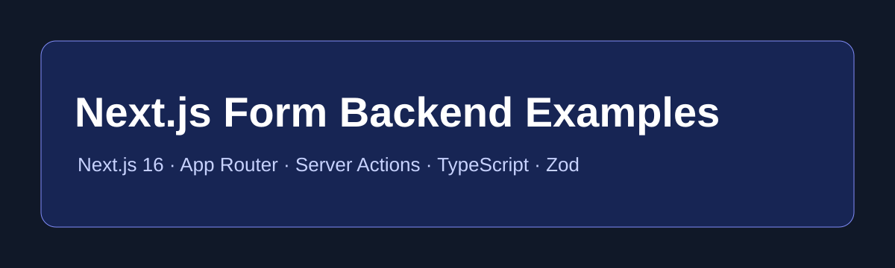

# Next.js Form Backend Examples



Practical **Next.js 16** App Router form examples using contact forms, Fetch, TypeScript, Server Actions, Route Handlers, Zod, and a hosted form endpoint. Build useful forms without maintaining separate processing infrastructure.

## Quick start

```bash
npm install
cp .env.example .env.local
npm run dev
```

Create an endpoint at [SmartFormify](https://www.smartformify.com/create-endpoint), restrict it to expected domains, and replace `YOUR_ENDPOINT_KEY`. See the current [developer documentation](https://www.smartformify.com/for-developers).

## Connect a Next.js form in three steps

1. Create a public endpoint and configure allowed domains.
2. Add its URL to a form action or send `{ data: fields }` with Fetch.
3. Test accepted, invalid, and rejected submissions from the deployed domain.

## Core Next.js form tutorials

| Example | Next.js pattern | Validation | Best for |
| --- | --- | --- | --- |
| [Basic Contact](tutorials/basic-app-router-form/README.md) | Native POST | HTML | Simplest integration |
| [Client Fetch](tutorials/client-fetch-form/README.md) | Client Component | HTML | AJAX-style experience |
| [TypeScript](tutorials/typescript-form/README.md) | Typed Fetch | TypeScript | Explicit request contracts |
| [Server Action](tutorials/server-action-form/README.md) | Server Action | Zod | Server-side handling |
| [Route Handler](tutorials/route-handler-form/README.md) | `/api` Route Handler | Zod | Additional server logic |
| [React Hook Form](tutorials/react-hook-form/README.md) | Client Component | RHF + Zod | Rich client forms |

[Native POST](tutorials/basic-app-router-form/README.md) · [Fetch](tutorials/client-fetch-form/README.md) · [JSON](tutorials/json-form-submit/README.md) · [FormData](tutorials/formdata-submit/README.md) · [Server Actions](tutorials/server-action-form/README.md) · [useActionState](tutorials/server-action-use-action-state/README.md) · [useFormStatus](tutorials/server-action-use-form-status/README.md) · [environment variables](tutorials/environment-variables/README.md) · [static export](tutorials/static-export-form/README.md) · [Pages Router](tutorials/pages-router-form/README.md)

## Ready-to-use Next.js forms

Browse [all 46 examples](examples/). Start with [contact](examples/contact-form/README.md), [quote](examples/quote-request-form/README.md), [booking](examples/booking-request-form/README.md), [event registration](examples/event-registration-form/README.md), [job application](examples/job-application-form/README.md), [bug report](examples/bug-report-form/README.md), or [multi-step lead form](examples/multi-step-lead-form/README.md).

They cover contact/general, sales, booking, registration, applications, feedback, support, business enquiries, property, and hospitality. Every form has distinct fields. None collect passwords, payments, API secrets, or direct file uploads.

## Environment variables and safety

`NEXT_PUBLIC_SMARTFORMIFY_ENDPOINT` is bundled into browser code and is **not private**. That is appropriate for direct submission because the submit URL is designed to be public. Do not commit `.env.local`; instead use SmartFormify domain restrictions. `SMARTFORMIFY_ENDPOINT` is server-only for a Server Action or Route Handler when browser access is unnecessary.

For JSON, check both `response.ok` and `result.success`, show `result.message` after failure, and reset only after accepted success. On success, handle `result.data.redirect_url` or `result.data.thank_you_content`. A Server Action is optional; direct browser submission is often simpler. App Router is primary; [Pages Router](tutorials/pages-router-form/README.md) material is intentionally small for legacy projects.

SmartFormify documents flat browser forms and JSON `data` requests, not binary uploads for Form Endpoints. The prior upload demo is therefore removed. Keep forms below documented endpoint defaults: 30 fields, 80-character field names, 5,000-character text values, and a 128 KB request body.

## Docs, contributing, and license

Conceptual guides are in [docs](docs/), including [validation](docs/nextjs-form-validation.md), [Server Actions vs Route Handlers](docs/server-actions-vs-route-handlers.md), and [troubleshooting](docs/troubleshooting.md). Read [CONTRIBUTING.md](CONTRIBUTING.md) and [SECURITY.md](SECURITY.md). Licensed under [MIT](LICENSE).
